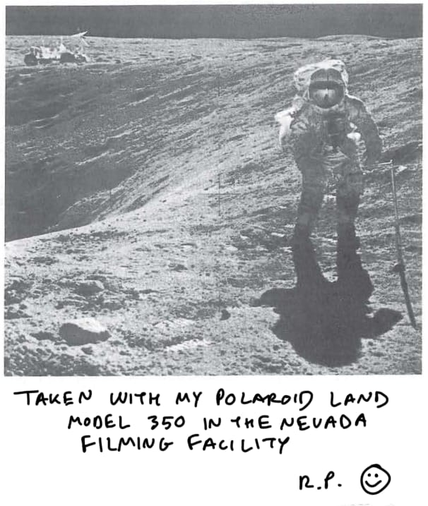

## What has been done?

- Ran **binwalk** in **Relativy.gif**, this gave us some secret embedded files that were hiding on that file  
 ```binwalk -Me filename.png```

- Ran **binwalk** for every other file in this directory, some of them had secret embedded files, others did not

- Using https://stegonline.georgeom.net/upload and finding out that **Dog.png** has 5 LSB green bits to hide a jpg image, we were able to extract the image **Dog.jpg**  
  
(in the report, this is the response for the evidence of the moon landing being a hoax)