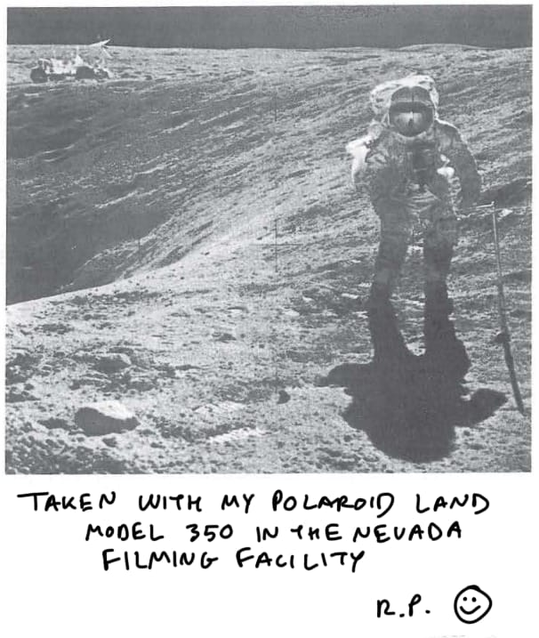
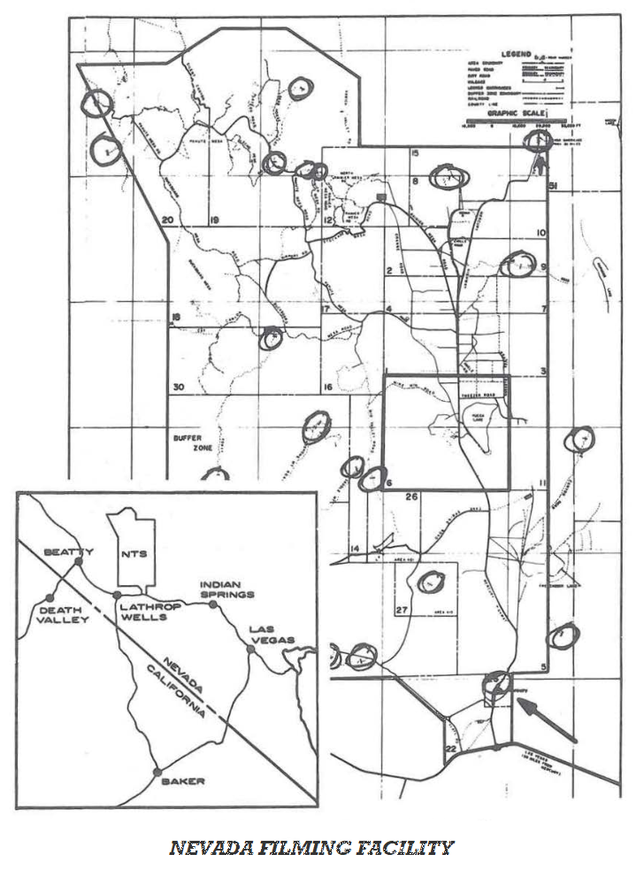
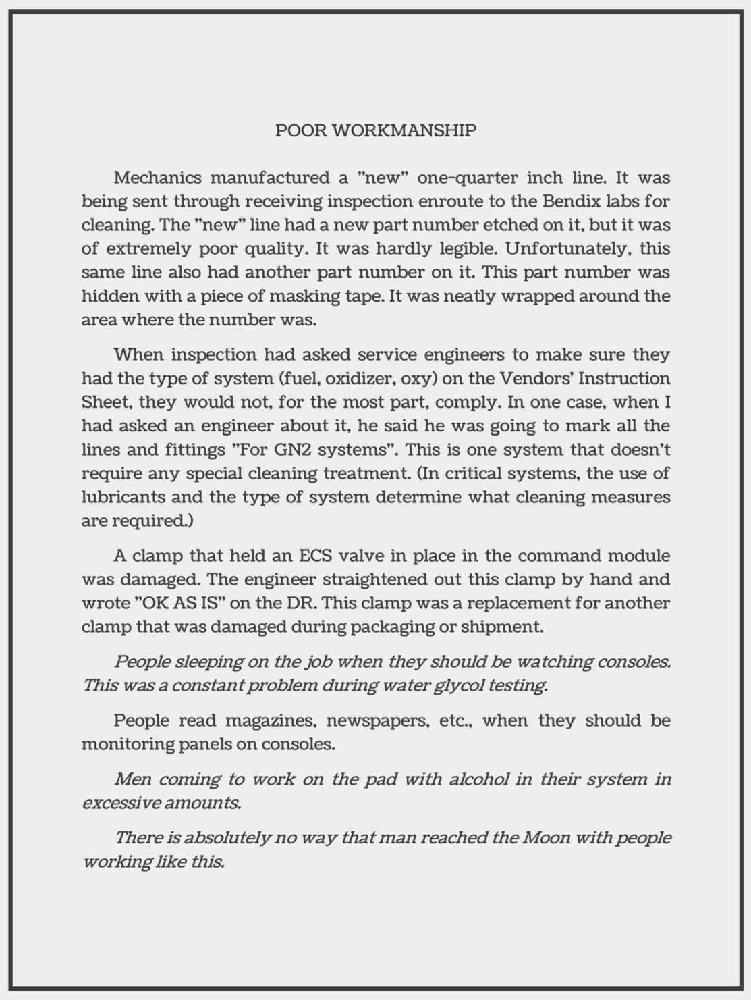
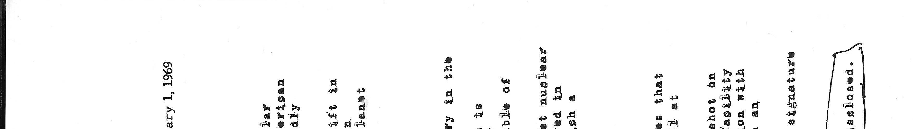

## What has been done?

- Ran **binwalk** in **Relativy.gif**, this gave us some secret embedded files that were hiding on that file  
 ```binwalk -Me filename.png```

- Ran **binwalk** for every other file in this directory, some of them had secret embedded files, others did not

- Using https://stegonline.georgeom.net/upload and finding out that **Dog.png** has 6 LSB green bits to hide a jpg image, we were able to extract the image **Dog.jpg**  
  
(in the report, this is the response for the evidence of the moon landing being a hoax)

- Using exiftool, we were able to see that **Relativity.gif** has a png on it's metadata (comment)  
 ```exiftool -b -comment Relativity.gif > Relativity.zip```  
 We found out it was a zip hidding in the comment, as the header of the file was ```PG```  
   
 **Nevada.png** is the name of the file that was inside the hidden zip

 - Once more, using https://stegonline.georgeom.net/upload and finding out that **Schedule.png** has 6 LSB red bits to hide a png image, we were able to extract the image **Schedule2.png**  
   

 - After running  ```exiftool Golf```, we found out that this file was a JPG file with a **163 byte** unknown header, so we used https://hexed.it/ to remove these 163 bytes of data from the header, after saving the result, we got **Golf.jpg** (looks like a part of a bigger image)  
    

- Regarding the previous found flag, looks like the unknown header was an incomplete pdf header (instead of a jpg with trash at its header), after completing it, we were able to extract [**Golf.pdf**](./csf-project1-artifacts-altered/Flags/Golf/Golf.pdf)